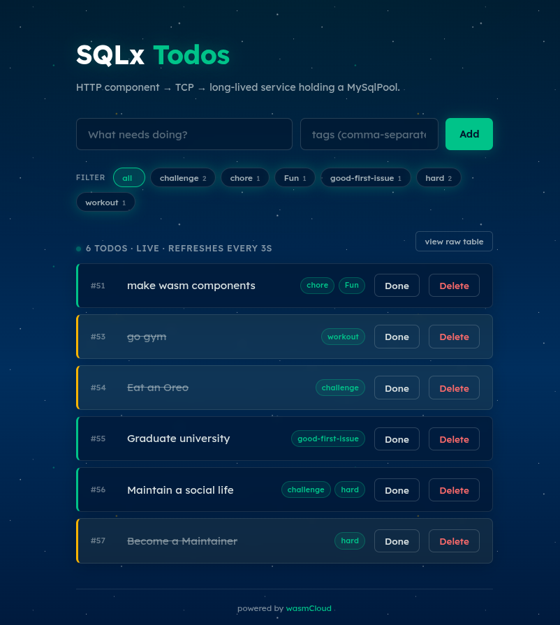
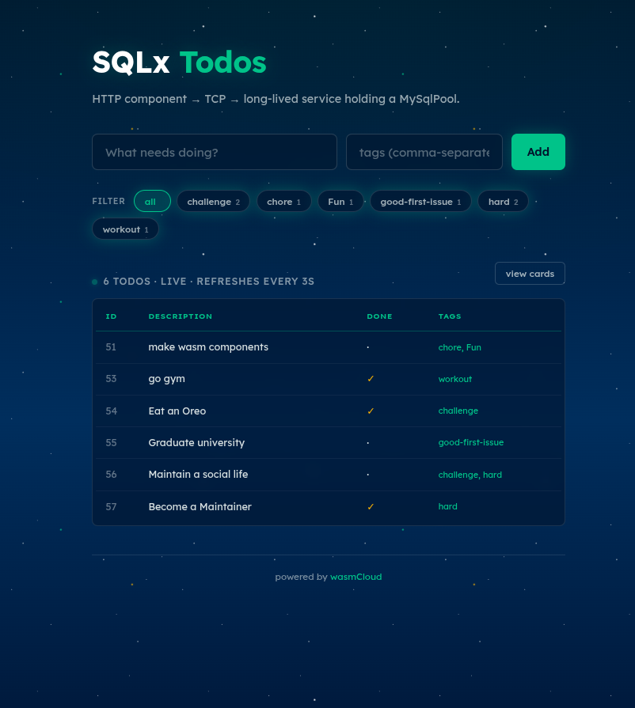

# sqlx-socket

A wasmCloud example showing how to reach real TCP services from inside a
sandboxed wasm component. Uses **SQLx** against MySQL as the concrete demo —
the component holds a long-lived connection pool, runs typed queries, and
issues multi-statement transactions over a tunnel the operator declares
explicitly in `.wash/config.yaml`.

This example exercises:

- The new **`dev.socket_tunnels`** block — explicit sandbox→host TCP allowlist
- A long-lived `sqlx::MySqlPool` held in a service workload
- SQLx's typed `query_as` + `#[derive(FromRow)]` mapping
- A transaction (`pool.begin()`) for "create todo + attach tags" atomicity
- A many-to-many JOIN with `GROUP_CONCAT` for tag aggregation
- A live UI: chip filters, tag input, raw-table view, polling refresh



## What you're seeing

Three actors, two of them sandboxed:

```
┌──────────┐   GET /todos     ┌──────────┐   TCP 127.0.0.1:7777   ┌──────────────┐   MySQL
│  browser │ ───────────────► │ http-api │ ─────────────────────► │ service-leet │ ◄──────►
│   (you)  │ ◄─────────────── │(component)│ ◄───────────────────── │  (service)   │
└──────────┘    JSON line     └──────────┘     JSON line          └──────────────┘
                              stateless                           long-running
                              per-request                         holds MySqlPool
                              scales out                          owns :7777
                                                                  + 4-conn pool
                                                                       │
                                                                       │ tunnel via wash:
                                                                       │ sandbox 127.0.0.1:3306
                                                                       │      ↓
                                                                       │ host    127.0.0.1:3307
                                                                       ▼
                                                                   MySQL
```

Both wasm workloads run inside a sandbox. The TCP between `http-api` and
`service-leet` (port 7777) is wash's **in-process loopback** — bytes never
touch the OS network. The TCP from `service-leet` to MySQL (port 3306) is a
real OS connection, gated by an explicit tunnel rule (see below).

## The socket-tunnel policy

By default, wash's sandbox blocks every TCP connect a component tries to make,
*including loopback dials to ports the host happens to be listening on*. To
reach MySQL on the host, the operator declares the route. This example uses
the **explicit rewrite form** as its default:

```yaml
# .wash/config.yaml
dev:
  socket_tunnels:
    rules:
      - sandbox_port: 3306
        host_addr: "127.0.0.1:3307"
```

Read: "if a component dials `127.0.0.1:3306`, route that connection to
`127.0.0.1:3307` on the real OS network." Match that against
`docker-compose.yml`, which deliberately exposes MySQL on host port **3307**
(not 3306). The component's `DATABASE_URL` in `service-leet/src/lib.rs` still
hardcodes `…@127.0.0.1:3306/…` — it never knows about the rewrite. If your
todos persist, it's proof the tunnel layer is doing the redirect at the OS
level. **The port skew is on purpose**: it's the smallest setup that observably
demonstrates `host_addr` decoupling from `sandbox_port`.

If you don't need a rewrite (sandbox and host port match), use the shorthand:

```yaml
    rules:
      - sandbox_port: 3306             # → 127.0.0.1:3306
```

Without a matching rule, `service-leet`'s first MySQL connect returns
`ConnectionRefused` — a deliberate change from the old "fallthrough" behavior
that silently let components reach anything on the host.

Three modes are available:

| `mode`     | Behavior                                                            |
|------------|---------------------------------------------------------------------|
| `strict`   | Default. Only in-process wash services and declared rules allowed. |
| `allow-all`| Opt-out: every TCP connect goes to the OS unmodified. Rules ignored.|
| `deny-all` | Block everything; in-process wash service traffic still works.      |

See [`crates/wash/src/config.rs`](../../crates/wash/src/config.rs) (the
`DevSocketTunnel` doc) for hostname rewriting, fan-in, and managed-DB
scenarios.

## Schema

Three tables, created by `service-leet` at startup:

```
wasi_todos                      wasi_todo_tags              wasi_tags
┌────────────────────┐          ┌──────────────┐            ┌──────────────────┐
│ id          BIGINT │ ◄────┐   │ todo_id  FK  │   ┌─────►  │ id        BIGINT │
│ description TEXT   │      └───│ tag_id   FK  │───┘        │ name VARCHAR(64) │
│ done        BOOL   │          │ PK(todo,tag) │            │ UNIQUE(name)     │
└────────────────────┘          └──────────────┘            └──────────────────┘
       ▲                              │   ON DELETE CASCADE both sides
       └──────────────────────────────┘
       ON DELETE CASCADE
```

Deleting a todo cascades to its link rows; tag rows themselves persist so the
filter chip cloud stays stable across single-todo deletes.

## Wire protocol

Line-delimited JSON over TCP. One command per line, one reply per line.

| Command                                                            | Reply                                                              |
|--------------------------------------------------------------------|--------------------------------------------------------------------|
| `{"op":"list"}`                                                    | `{"ok":true,"todos":[{"id":1,"description":"…","done":false,"tags":["work"]}, …]}` |
| `{"op":"list","tag":"work"}`                                       | same shape, filtered to todos that carry the tag                   |
| `{"op":"create","description":"…","tags":["work","urgent"]}`       | `{"ok":true,"id":42}` (todo + tags inserted in one transaction)    |
| `{"op":"done","id":42}`                                            | `{"ok":true}`                                                      |
| `{"op":"delete","id":42}`                                          | `{"ok":true}`                                                      |
| `{"op":"tags"}`                                                    | `{"ok":true,"tags":[{"name":"work","count":3}, …]}`                |
| (any error)                                                        | `{"ok":false,"error":"…"}`                                         |

## SQLx features in play

- **`#[derive(FromRow)]`** on `TodoRow` and `TagCount` — typed row → struct
  mapping, no manual `try_get` chains.
- **`sqlx::query_as::<_, T>`** for typed result sets.
- **DB shape vs. API shape**: `TodoRow` decodes `done` as `i8` (MySQL `BOOL`
  is `TINYINT(1)`); `From<TodoRow> for Todo` widens it to `bool` and splits
  the comma-separated tag string into `Vec<String>` for the JSON API.
- **Transactions** via `pool.begin()`: `Create` inserts the todo, upserts
  each tag (`INSERT IGNORE INTO wasi_tags`), reads the resulting tag id back,
  and inserts the link row — all atomically. A failure anywhere rolls back.
- **JOIN + `GROUP_CONCAT`** for the many-to-many: `service-leet/src/lib.rs`
  defines `LIST_ALL_SQL` and `LIST_BY_TAG_SQL` as `&'static str` constants
  (the SQLx fork enforces compile-time string constness — no `format!`).
- **Pool reuse**: a single `Arc<MySqlPool>` is built in `init_pool()` and
  shared across every accepted TCP connection. The host-MySQL handshake
  happens at most 4 times (the pool's `max_connections`) regardless of how
  many HTTP requests land on `http-api`.

## The UI

Served at `/`. Lexend type, wasmCloud aqua-on-space-blue, with:

- **Tag input** beside the description: comma-separated, e.g. `work, urgent`.
- **Tag chips** on each card; **filter chips** above the list (click to
  filter, click `all` to clear). Counts come from the `/tags` endpoint.
- **Live polling**: the UI refetches `/todos` and `/tags` every 3 seconds. If
  you insert a row from another tab or the `mysql` CLI, it appears on its own.
- **Raw-table view** toggle: same data, rendered as `id / description / done /
  tags` columns. Useful when you want to see what's actually in MySQL.



## Prerequisites

- [Rust](https://rustup.rs/) (nightly) with the `wasm32-wasip2` target:
  ```bash
  rustup target add wasm32-wasip2
  ```
- [Wasm Shell (`wash`)](https://wasmcloud.com/docs/installation) built from
  this branch (the `socket_tunnels` config field is new).
- A reachable MySQL. The bundled `docker-compose.yml` brings one up on host
  port **3307** (intentionally — see [the socket-tunnel section](#the-socket-tunnel-policy))
  with the matching credentials, a persistent volume so your todos survive
  restarts, and a healthcheck:
  ```bash
  docker compose up -d
  # tear down + wipe the volume:
  # docker compose down -v
  ```

## Quick start

```bash
wash dev
open http://localhost:8000/
```

Or hit the API directly:

```bash
# create with tags
curl -X POST http://localhost:8000/todos \
  -H "Content-Type: application/json" \
  -d '{"description":"buy milk","tags":["errand","weekend"]}'
# => {"ok":true,"id":1}

# list everything
curl http://localhost:8000/todos
# => {"ok":true,"todos":[{"id":1,"description":"buy milk","done":false,"tags":["errand","weekend"]}]}

# filter by tag
curl "http://localhost:8000/todos?tag=errand"

# tag cloud
curl http://localhost:8000/tags
# => {"ok":true,"tags":[{"name":"errand","count":1},{"name":"weekend","count":1}]}

# mark done
curl -X POST http://localhost:8000/todos/done \
  -H "Content-Type: application/json" -d '{"id":1}'

# delete (cascades to link rows; tag rows persist)
curl -X POST http://localhost:8000/todos/delete \
  -H "Content-Type: application/json" -d '{"id":1}'
```

### Verifying the tunnel really is gating

Temporarily remove the `socket_tunnels` block from `.wash/config.yaml` and
restart `wash dev`. The service's first MySQL connect should fail with
`ConnectionRefused` — confirming that without a declared rule the sandbox
won't let the component escape, even to a port the host happens to listen on.

Set `mode: allow-all` instead and tags/rules are ignored; every TCP connect
passes through.

## Project structure

```
sqlx-socket/
├── .wash/config.yaml          # build + dev config, including socket_tunnels
├── docker-compose.yml         # MySQL 8 with persistent volume + healthcheck
├── Cargo.toml                 # workspace root; pins sqlx to the wasip3 branch
├── wit/world.wit
│
├── service-leet/              # long-lived DB service
│   ├── src/lib.rs             # Arc<MySqlPool>, JSON-over-TCP loop, transactions
│   └── Cargo.toml
│
└── http-api/                  # stateless HTTP front-end
    ├── src/lib.rs             # /todos + /tags REST → JSON over TCP
    ├── ui.html                # UI served at /
    └── Cargo.toml
```

## How it works

`.wash/config.yaml`:

- **`build.command`** — builds the workspace for `wasm32-wasip2`.
- **`build.component_path`** — the HTTP API component (per-request).
- **`dev.service_file`** — the long-running DB service. `wash dev` starts this
  as a background workload; the HTTP component reaches it over wash's
  in-process loopback (no OS socket, no tunnel rule required).
- **`dev.socket_tunnels.rules`** — the only TCP escapes the sandbox permits.
  One rule declared: sandbox `127.0.0.1:3306` rewrites to host
  `127.0.0.1:3307` (where docker-compose has MySQL listening). Nothing else
  can escape.

The runtime treats the two workloads differently:

- **`http-api`** is instantiated per-request and runs to completion. The host
  scales it out for concurrency.
- **`service-leet`** is started once and runs forever. It owns the `MySqlPool`
  and the `127.0.0.1:7777` listener. Every short-lived HTTP component instance
  connects to it.

## Customizing

### Add a new operation

Two places: in `service-leet/src/lib.rs`, add a variant to `Command` and a
match arm in `handle_command`. In `http-api/src/lib.rs`, add a handler that
calls `call_service(json!({"op":"…", …}))` and route it from `main`.

### Reach a different host (DNS, port rewrite, fan-in)

The tunnel rule isn't a 1:1 mapping — `host_addr` is independent of
`sandbox_port`. To point the same `127.0.0.1:3306` dial at a managed DB:

```yaml
dev:
  socket_tunnels:
    rules:
      - sandbox_port: 3306
        host_addr: "db.internal:25060"
```

The component still dials `127.0.0.1:3306`; the OS connection goes to
`db.internal:25060`. Hostnames are resolved once at workload start.

### Change pool size

`MySqlPoolOptions::new().max_connections(N)` in `service-leet/src/lib.rs`.

### Change the inter-component TCP port

`service-leet/src/lib.rs` (bind) and `http-api/src/lib.rs` (connect) — keep
them in sync. No tunnel rule needed: 7777 stays inside wash's in-process
loopback.
